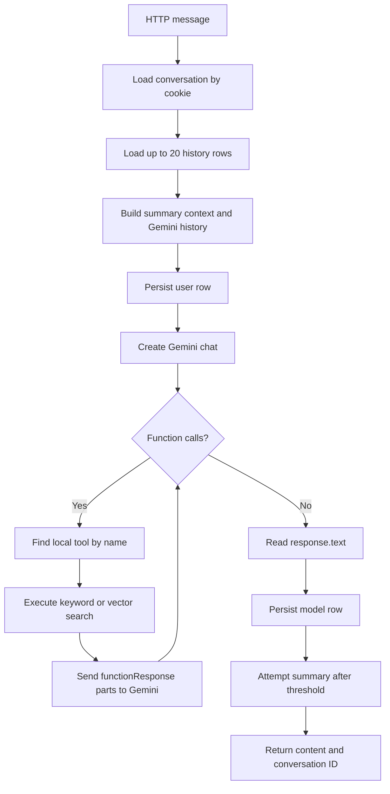

# AI System

## Providers and Models

| Purpose | SDK | Model configured in source |
| --- | --- | --- |
| Chat generation, tool calling, summaries | `@google/genai` | `gemini-3.5-flash-lite` |
| Query embeddings | `@google/generative-ai` | `gemini-embedding-001` |

The model strings are configured in `container.js` and `embedding.js`. The repository does not verify model availability, quotas, or embedding dimensions.

## Prompt Construction

`ChatRepository.sendMessage` creates a Gemini chat with:

- `systemInstructions` from `src/config/systemInstructions.js`.
- A generated prior-summary block containing `conversation.summary` or `No previous summary.`
- Up to 20 reconstructed history records.
- The two manually mapped Gemini function declarations.
- `temperature: 0`.

The system instruction defines the assistant as Peter (`بطرس`), primarily speaking Arabic, answering Christian/Bible questions with retrieval, avoiding unnecessary introductions, and not using tools for general questions. It also embeds developer identity and portfolio URLs in the system prompt.

The repository does not enforce the prompt's routing rules. Gemini decides whether to call a tool, and the server executes whatever declared function call it receives.

## Message Processing Flow

The initial user message is passed to `chat.sendMessage({ message })` after the user row is stored. Tool responses are converted to `functionResponse` parts. Unknown tools produce an `{ error: "Tool not found" }` response part; callback exceptions produce an error response part and the model is allowed to continue.

## Bible Retrieval Tools

### `search-verse-by-keyword`

This tool uses `VersesService` and `VersesRepository` to synchronously read `src/data/verses.json` and filter records where `verse.text.includes(keyword)` or `verse.book.includes(keyword)`. Matching is case/normalization sensitive. It returns JSON text for matches or the Arabic string `لا يوجد نتايج`.

### `search_bible_rag`

This tool embeds the keyword with `gemini-embedding-001`, runs an aggregation with:

- Atlas index: `vector-index`.
- Vector field: `embedding`.
- `numCandidates: 100`.
- Result limit: `3`.
- Optional exact `book == bookFilter` filter.

Results are formatted as `[book chapter:first-last]\ntext`, separated by `---`. Empty results return `لا يوجد نتايج`.

The repository does not establish that Atlas is configured, that chunks have been seeded, or what vector dimensions/index similarity are used.

## Conversation Context

On a request with a valid cookie, the repository loads the conversation summary and up to 20 history records. It reverses the database result to chronological order before passing it to Gemini. However, `ChatHistory` stores model rows with role `model`, while reconstruction checks for role `assistant`; model rows are therefore sent as Gemini `user` rows. Also, `ChatHistory` has no timestamps even though the query sorts by `createdAt`.

The summary is inserted as read-only background context and is intended for pronoun resolution and follow-up continuity. It is generated only after at least 20 new messages since the previous summary. There is no separate summary provider, job queue, retry policy, or concurrency protection.

## Summary Generation

`makeChatSummary` sends the new message window and prior summary to the same chat model with `summaryPrompt.js`. The prompt asks for concise Modern Standard Arabic sections such as user profile, preferences, active goals, recent topics, biblical references, decisions, and unresolved items. The generated text is stored in `Conversation.summary`, and `summaryUpToMessage` advances to the number of messages included.

Summary generation is synchronous within the HTTP request. A failure can prevent a response after the model answer has already been saved. Concurrent requests can race on the count and summary boundary.

## Persistence and Delivery

The final `response.text` is stored in `ChatHistory` with role `model`, then returned from the repository as `content`. The controller ultimately sends that text as the JSON response body and sends the conversation identifier only in an unsigned HTTP-only cookie.

There is no streaming implementation: the backend waits for the complete Gemini response and then calls `res.json`. There is no fallback provider, model retry, timeout, circuit breaker, or provider failover.
