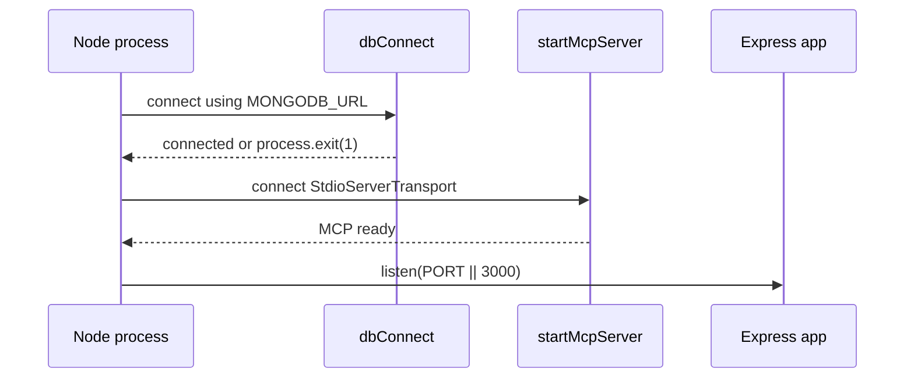
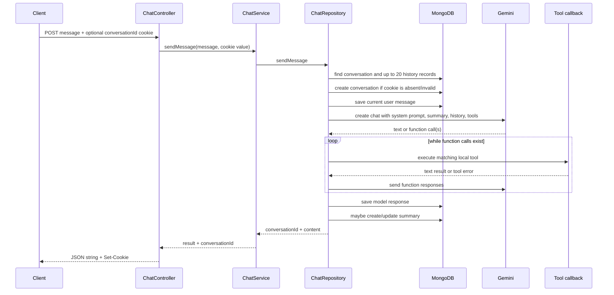

# Backend Architecture

## Architectural Pattern

The backend uses a small layered/module structure with manual dependency wiring:

```mermaid
flowchart TB
    Entry[index.js] --> DB[config/dbConnect.js]
    Entry --> MCP[mcp/server.js]
    Entry --> App[src/app.js]
    App --> Routes[modules/chat/chat.routes.js]
    App --> AuthRoutes[modules/auth/auth.routes.js]
    AuthRoutes --> AuthController[AuthController]
    AuthController --> AuthService[AuthService]
    AuthService --> AuthRepo[AuthRepository]
    AuthRepo --> UserSession[(User + Sessions)]
    Routes --> Protect[accessToken middleware]
    AuthRoutes --> Protect
    Routes --> Controller[modules/chat/chat.controller.js]
    Controller --> Service[modules/chat/chat.service.js]
    Service --> ChatRepo[modules/chat/chat.repository.js]
    ChatRepo --> Conversation[data/Conversation.js]
    ChatRepo --> History[data/ChatHistory.js]
    ChatRepo --> Prompt[config/systemInstructions.js + summaryPrompt.js]
    ChatRepo --> Gemini[@google/genai]
    ChatRepo --> ToolDefs[mcp/tools.js]
    ToolDefs --> VerseService[modules/verses/verses.service.js]
    VerseService --> VerseRepo[modules/verses/verses.repository.js]
    VerseRepo --> VerseFile[data/verses.json]
    ToolDefs --> Embedding[utils/embedding.js]
    Embedding --> GeminiEmbedding[@google/generative-ai]
    ToolDefs --> Chunk[data/Chunk.js]
```

`container.js` is the composition root. It instantiates the verse, chat, and auth repositories/services/controllers/routes, maps tool declarations for Gemini, and exports both routers. There is no framework-level dependency injection container; dependencies are passed through constructors manually.

## Startup

`index.js` loads dotenv configuration, imports the Express app, connects to MongoDB, starts the MCP stdio server, and only then starts HTTP on `process.env.PORT` or `3000`.



A database failure exits from `dbConnect`. Other startup errors are logged by `startServer` in `index.js`; it does not explicitly close resources or exit.

## HTTP Layers

| Layer | Source | Responsibility |
| --- | --- | --- |
| Application | `src/app.js` | Creates Express app, loads cookies/JSON, configures credentialed CORS, mounts auth and chat routers, and normalizes errors. |
| Auth routes | `src/modules/auth/auth.routes.js` | Registers Google OAuth, `/me`, refresh, and logout endpoints. |
| Auth middleware | `src/middlewares/auth.js` | Validates the access-token cookie and sets `req.user`. |
| Chat routes | `src/modules/chat/chat.routes.js` | Protects message, history, and active-conversation selection routes. |
| Auth service/repository | `src/modules/auth/auth.service.js`, `auth.repository.js` | Exchanges Google identity, manages refresh-token hashes/sessions, and loads public user data. |
| Chat controller/service/repository | `src/modules/chat/chat.controller.js`, `chat.service.js`, `chat.repository.js` | Enforces owner-scoped conversation access, reads/writes the active cookie, invokes Gemini, and stores history/summaries. |

The service has a faulty array-result branch: it returns a string without `conversationId`, although the controller expects an object. Current repository chat responses are strings, so that branch is not normally used.

## Request and AI Execution Flow



## Tool and Data Dependencies

`mcp/tools.js` imports `versesService` from `container.js`, while `container.js` imports the tools. This creates a circular ESM dependency. The current callbacks use the imported binding later, but the arrangement is fragile.

`mapToolsToGemini.js` converts the two known tools to manually written Gemini function declarations. The imported `zodToJsonSchema` is not used. The MCP server registers the original Zod-backed definitions, while chat uses the manual Gemini mappings.

## Error Handling and Validation

There is no centralized Express error middleware. The controller does not validate `message`, and it does not catch service/repository errors. Express therefore determines the response for uncaught request errors. `VersesService` rejects empty keyword searches, but that validation is only reached through the keyword tool.

Auth is cookie-based; production deployments must configure the exact `FRONTEND_URL`, Google callback URL, and cookie SameSite policy. There is no application rate limiter or graceful shutdown path.
