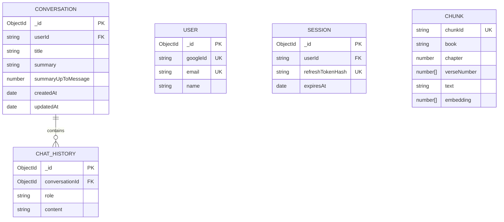

# Database

## Connection

`src/config/dbConnect.js` connects Mongoose using the `MONGODB_URL` environment variable. It skips work when the connection is already open. A connection failure is logged and calls `process.exit(1)`.

## Entity Relationship

Chat history references its conversation, and each conversation has a required string `userId` that is checked against the authenticated user. Refresh sessions are stored by user ID with a SHA-256 refresh-token hash; raw refresh tokens are not stored. `Chunk` is independent and is used by vector retrieval.

## `Conversation` collection

Source: `src/data/Conversation.js`.

| Field | Type | Required/default | Constraints and use |
| --- | --- | --- | --- |
| `title` | String | Required; default `"New Conversation"` | Used when a new conversation is created. No length or uniqueness constraint. |
| `userId` | String | Required | Authenticated owner ID; conversation reads and sends must match it. |
| `summary` | String | Optional | Long-term summary generated by Gemini. |
| `summaryUpToMessage` | Number | Optional; default `0` | Count boundary used by summary generation. No minimum or integer validation. |
| `createdAt` | Date | Automatic | Added by Mongoose timestamps. |
| `updatedAt` | Date | Automatic | Added by Mongoose timestamps. |

No explicit indexes are declared in this schema.

## `ChatHistory` collection

Source: `src/data/ChatHistory.js`.

| Field | Type | Required/default | Constraints and use |
| --- | --- | --- | --- |
| `conversationId` | ObjectId | Required | References the `Conversation` model and has a MongoDB index. |
| `role` | String | Required | Enum is exactly `"user"` or `"model"`. |
| `content` | String | Required | Stored user messages and final model text. |

Timestamps are enabled for new history records. The repository sorts by creation time and ID for stable history retrieval. Persisted model rows use `"model"`; the frontend maps that role to `assistant` for display.

## `Chunk` collection

Source: `src/data/Chunk.js`.

| Field | Type | Required/default | Constraints and use |
| --- | --- | --- | --- |
| `chunkId` | String | Required | `unique: true`, creating a uniqueness index. Generated from book/chapter/verse range by `createChunks`. |
| `book` | String | Required | Bible book name; used by optional exact vector-search filter. |
| `chapter` | Number | Required | Chapter number. |
| `verseNumber` | Array of Numbers | Required | Verse numbers represented by the chunk. |
| `text` | String | Required | Retrieved text sent to Gemini. |
| `embedding` | Array of Numbers | Optional | Generated with `gemini-embedding-001` and queried by Atlas vector search. |

The MongoDB vector index is not declared by Mongoose. The tool expects an external Atlas index named `vector-index` on the `embedding` path. Its dimensions and similarity configuration are not established in the repository.

## Seed Data and Constraints

`src/config/seed.js` reads `src/data/sampleChapter.json`, chunks it at approximately 500 characters, generates embeddings sequentially, and skips existing `chunkId` values. It retries only errors with `status === 429`, waiting 40 seconds between attempts. The seed script is not invoked by normal server startup.

`src/data/verses.json` is a separate local keyword-search dataset with three records. It is not stored in MongoDB.

## Data Lifecycle

A chat request can create one `Conversation` and two `ChatHistory` rows (user then model). There are no API routes for reading, editing, or deleting these records. Summary generation reads messages after `summaryUpToMessage` and writes back to the parent conversation when at least 20 new messages exist.
