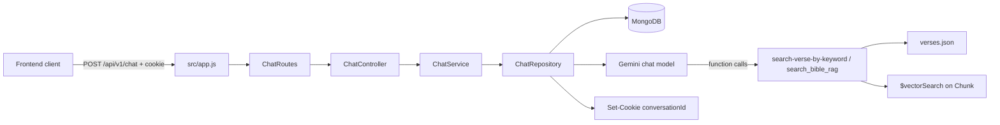

# Bible AI Assistant Backend Documentation

## Overview

This backend is an Express and MongoDB service for a Christian Bible AI chatbot. It supports Google OAuth with HTTP-only access/refresh cookies, authenticated user lookup/session refresh/logout, and protected chat/history routes. Chat conversations are owned by the authenticated user and the active conversation is selected using an HTTP-only `conversationId` cookie. Gemini responses and message history are persisted; summaries may be generated periodically.

The repository also exposes the same Bible tools through an MCP server on stdio when the application starts.

## Documentation Index

- [Architecture](./ARCHITECTURE.md): startup, modules, dependencies, and execution flows.
- [API Reference](./API.md): the registered HTTP endpoint and its exact behavior.
- [Database](./DATABASE.md): Mongoose schemas, collections, indexes, and relationships.
- [AI System](./AI_SYSTEM.md): Gemini integration, prompts, tools, history, and summaries.
- [Frontend Integration](./FRONTEND_INTEGRATION.md): the client contract and conversation lifecycle.
- [Features and Limitations](./FEATURES_AND_LIMITATIONS.md): implemented behavior, partial behavior, and gaps.

## Implemented Features

- Google OAuth with access/refresh token cookies and rotating refresh sessions.
- Authenticated, owner-scoped chat and conversation-history access.
- Cookie-based conversation continuation and selection.
- Gemini chat generation using `@google/genai`.
- Gemini function calling for two Bible-search tools.
- Keyword search over the bundled `src/data/verses.json` file.
- Vector retrieval over MongoDB `Chunk` documents using Gemini embeddings.
- Persistence of user and model messages in MongoDB.
- Conversation summaries after at least 20 new stored messages.
- MCP registration of the Bible-search tools over stdio.
- A seed script for chunking `sampleChapter.json` and generating embeddings.

## Technology Stack

- Node.js ES modules (`"type": "module"`).
- Express and `cookie-parser` for HTTP handling.
- Mongoose for MongoDB access.
- Google Gemini SDKs: `@google/genai` for chat/summaries and `@google/generative-ai` for embeddings.
- Zod for MCP tool input schemas.
- Model Context Protocol SDK for the stdio tool server.

`express` is imported by the application but is not listed as a direct dependency in `package.json`; the current lockfile contains it transitively. The project has no automated test script beyond the placeholder `npm test` command.

## Quick Architecture

The backend does not expose separate conversation, history, authentication, user, or summary HTTP endpoints. Details and limitations are documented in the linked files above.
